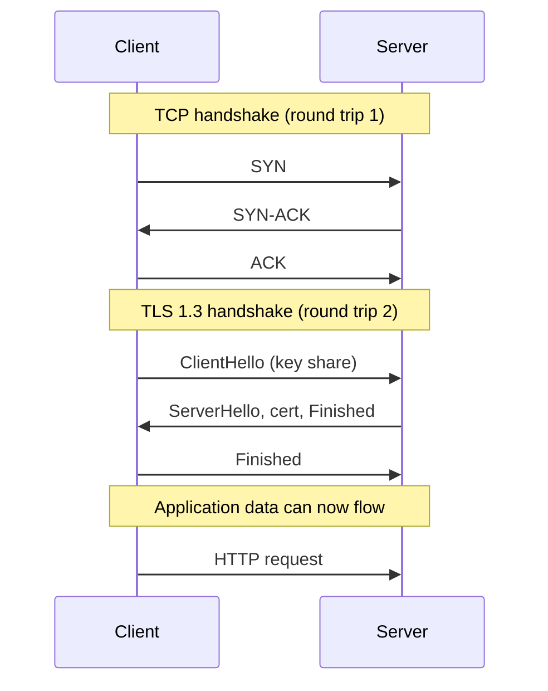
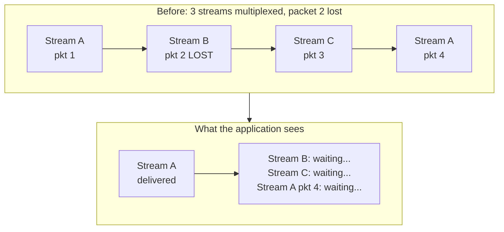
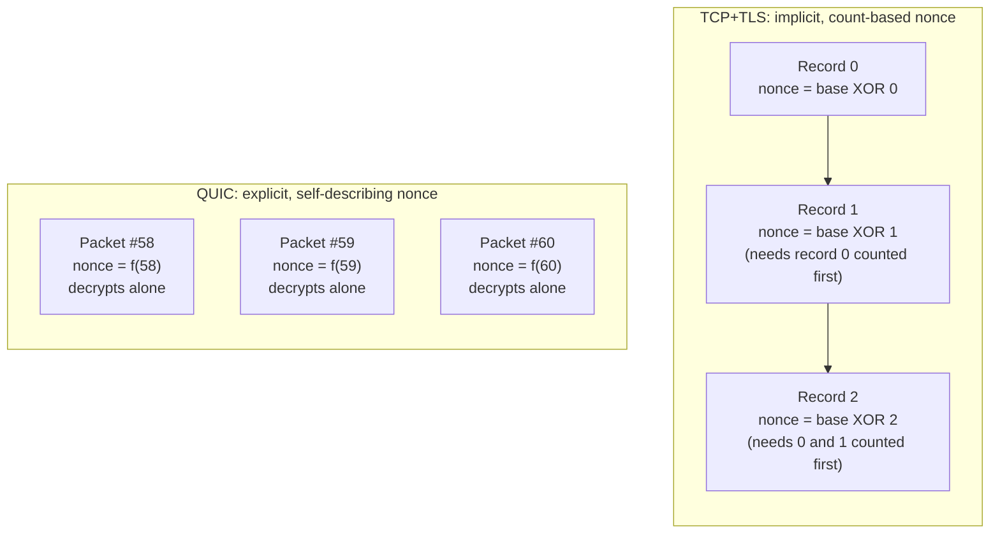
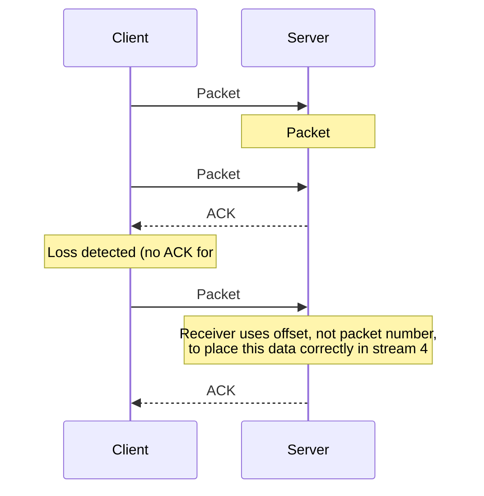
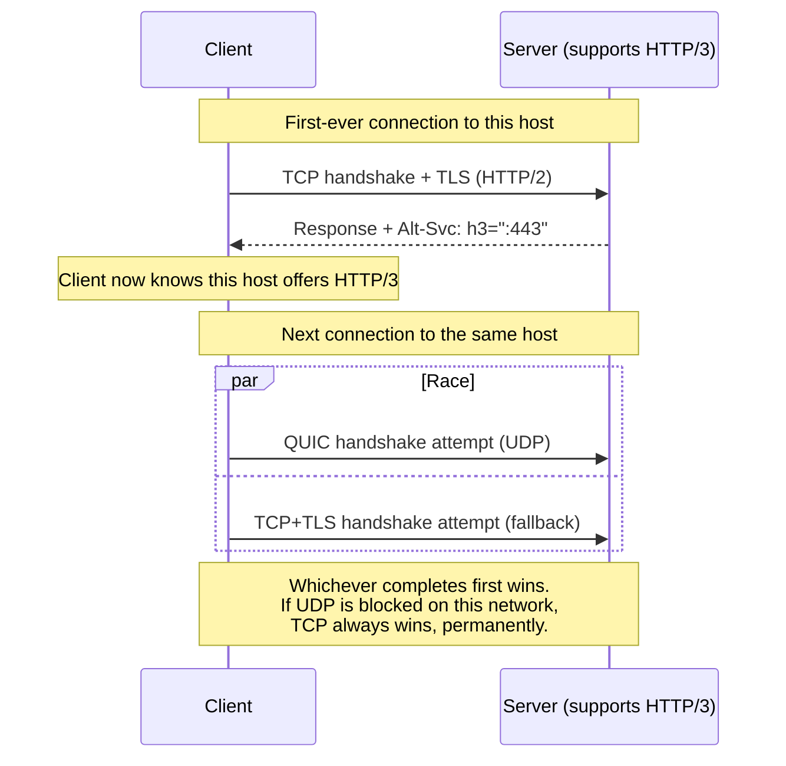
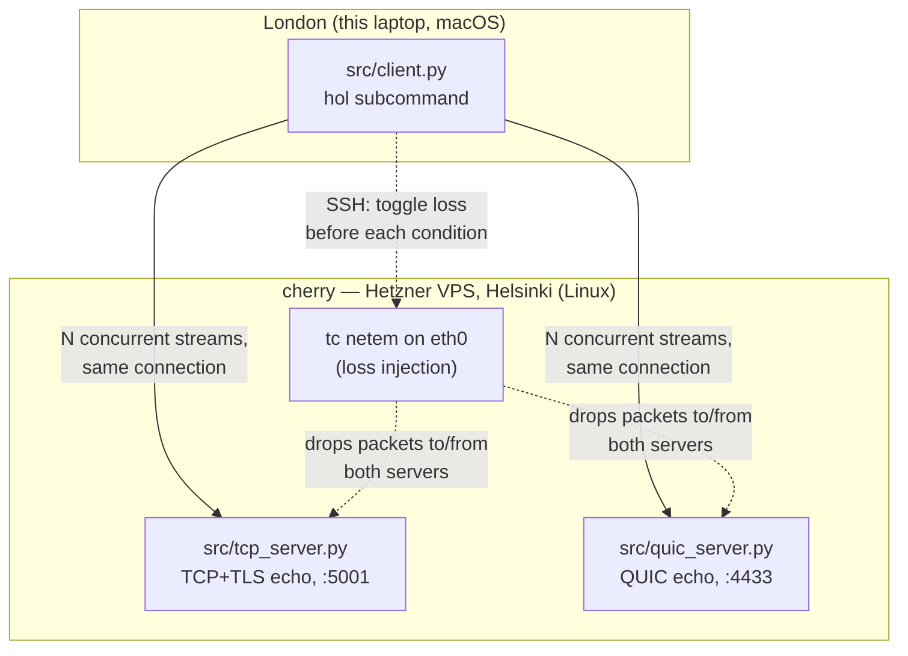

# QUIC vs TCP+TLS, over a real internet path

This repository runs a real network test — not a simulation — comparing QUIC
against classic TCP+TLS. The client is a laptop on a home network in London;
the server is a Linux (Ubuntu) Hetzner Cloud VPS in Helsinki, Finland,
referred to throughout this repo's scripts and docs as `cherry`. Traffic
crosses the real internet, with a real round trip time of roughly 45–55ms.
No artificial delay is added anywhere. Packet loss, where used, is injected
for real with `tc netem` on `cherry`'s network interface — a Linux-only
tool, which is also why loss injection happens server-side rather than on
the (macOS) client; see [How the test scripts work](#how-the-test-scripts-work).

The goal is to make two specific, falsifiable claims concrete:

1. **QUIC's handshake completes in fewer round trips than TCP+TLS's**, because
   QUIC folds transport and cryptographic negotiation into the same exchange
   instead of running them as two separate sequential protocols.
2. **A single lost packet stalls only the QUIC stream it belonged to**, while
   the same loss on TCP+TLS stalls *every* stream sharing that connection,
   because TCP has no concept of "stream" at the transport layer — it's one
   ordered byte pipe, however many logical requests are multiplexed onto it.

Everything below is written so that someone who has never encountered QUIC
before can follow the argument from first principles. If you already know
what a nonce is and why TCP is head-of-line blocked, skip to
[What this repository actually measures](#what-this-repository-actually-measures).

## Contents

- [Why a handshake exists at all](#why-a-handshake-exists-at-all)
- [Two separate problems with HTTPS over TCP](#two-separate-problems-with-https-over-tcp)
- [What "one ordered line" means, at the packet level](#what-one-ordered-line-means-at-the-packet-level)
- [QUIC's fix, at the same packet level](#quics-fix-at-the-same-packet-level)
- [Retransmission: stream offset vs. packet number](#retransmission-stream-offset-vs-packet-number)
- [QUIC's three handshake key levels](#quics-three-handshake-key-levels)
- [HTTP/2 vs HTTP/3](#http2-vs-http3)
- [What this repository actually measures](#what-this-repository-actually-measures)
- [How the test scripts work](#how-the-test-scripts-work)
- [Results](#results)
- [Running it yourself](#running-it-yourself)

## Why a handshake exists at all

Suppose you and a stranger need to agree on a secret codeword, but the only
way to communicate is by shouting across a crowded room where anyone can
hear you. You can't just shout the codeword — everyone would know it. You
need some exchange of information, in public, that lets the two of you both
arrive at the same secret while anyone eavesdropping ends up with nothing
usable.

That's the situation a browser and a web server are in every time a new
HTTPS connection starts. They have never met. The network between them —
your ISP, transit providers, the server's ISP — can read every unencrypted
byte. Yet by the end of a short exchange, both sides hold an identical
symmetric encryption key that nobody who only watched the exchange can
derive. This is what a *handshake* is: a protocol for two parties to agree
on a shared secret over a channel a third party can observe.

TLS (the "S" in HTTPS) is the protocol that does this. It uses public-key
cryptography (Diffie-Hellman key exchange, specifically) so that even a
perfect eavesdropper who records the entire handshake cannot compute the
resulting shared secret. That part is not the problem this repository is
about — TLS's cryptography is sound and unchanged in spirit between the old
world and the new. What changed is *how many round trips it takes* and
*what happens to that connection afterwards*.

## Two separate problems with HTTPS over TCP

Classic HTTPS is TLS running on top of TCP. That pairing has two distinct
weaknesses. It's important to keep them separate, because QUIC fixes them
for two different reasons and the fixes are easy to conflate.

**Problem A — the handshake costs two sequential round trips, and that cost
is fixed.** TCP and TLS are layered, and layering means sequencing: TCP
doesn't know or care that TLS is about to run on top of it, so it completes
its own three-way handshake (SYN, SYN-ACK, ACK) *first*, establishing a
reliable ordered pipe, before TLS gets to send a single byte. Only then does
TLS run its own handshake on top. Two protocols, two round trips, paid in
full on every fresh connection — regardless of how fast, slow, lossy, or
clean the network is. This cost doesn't get worse under bad conditions; it's
just always there.



**Problem B — a single lost packet blocks every stream sharing the
connection, and that cost is conditional.** Modern HTTP/2 multiplexes many
logical requests (say, a dozen images and API calls) over one TCP
connection to avoid paying Problem A's cost repeatedly. But TCP guarantees
one thing and one thing only: bytes arrive at the application **in the
order they were sent, with nothing missing**. If packet 47 of 200 is lost,
TCP will not hand *any* of packets 48 through 200 to the application — not
even the ones for a completely unrelated HTTP/2 stream — until a
retransmission of packet 47 arrives and fills the gap. This is
**head-of-line (HOL) blocking**, and unlike Problem A, its cost is
*conditional*: it depends on the loss rate, the RTT (how long a
retransmission takes to arrive), and how many independent streams happen to
be sharing that one connection when the loss occurs.



## What "one ordered line" means, at the packet level

It's worth being precise about *why* TCP behaves this way, because the
mechanism is what QUIC actually redesigns.

TCP delivers a single ordered byte stream to the application. The kernel's
TCP receive buffer holds every segment that arrives, but it will not release
bytes to the reading application past the first gap. If segments carrying
bytes 1000–1999 and 3000–3999 have arrived but 2000–2999 has not, the
application can read bytes up to 999 and then blocks — the 3000–3999 bytes
are sitting in the kernel buffer, fully received, but withheld until 2000
arrives.

This interacts badly with TLS. TLS turns the byte stream into a sequence of
*records*, each individually encrypted. The AEAD (authenticated encryption)
scheme TLS uses needs a nonce for each record, and TLS derives that nonce
implicitly from a **record sequence counter** — record 0 uses nonce
`base XOR 0`, record 1 uses `base XOR 1`, and so on. Nothing in the record
itself states which number it is; both sides just count. That means to
decrypt record N+1 correctly, you must have already counted through record
N — which, combined with TCP's ordered-delivery guarantee, means the
byte-level blocking above becomes a decryption-level blocking too. There's
no way to skip ahead.

## QUIC's fix, at the same packet level

QUIC runs over UDP, and each UDP datagram carries exactly one QUIC packet
(with rare coalescing exceptions during the handshake). Critically, **every
QUIC packet header carries its own explicit packet number** — not an
implicit counter both sides track, but a number written directly into the
packet. QUIC's AEAD nonce is derived directly from that explicit number, not
from a count of how many packets arrived before it.

The consequence: a QUIC packet can be decrypted the instant it arrives,
independent of whatever order it showed up in. There is no "waiting to count
up to N" — the packet announces its own N. Loss of one packet no longer
creates a decryption dependency for any other packet, on any stream.



QUIC then layers *streams* on top of these independently-decryptable
packets, each stream with its own flow control and its own delivery order
guarantee — but that guarantee applies **per stream**, not connection-wide.
Losing a packet belonging to stream B has no effect on the deliverability of
packets belonging to stream A or C, because nothing about decrypting or
processing A's packets ever depended on B's.

## Retransmission: stream offset vs. packet number

If packet numbers are never reused, how does QUIC retransmit lost data
without breaking the nonce scheme? By keeping two coordinates for data that
are deliberately independent:

- **Stream offset** — the logical byte position within a stream's byte
  sequence. "This chunk is bytes 4096–8191 of stream 4." This is what the
  receiving application ultimately cares about, and it never changes for a
  given piece of data no matter how many times it's retransmitted.
- **Packet number** — which physical transmission attempt carried that data
  over the wire. Strictly increasing, never reused, one per QUIC packet
  actually sent.

When a packet is lost, QUIC doesn't "resend packet #58." It takes the
stream data that was in #58, puts it in a brand new packet — say, #71 —
with its own new packet number and therefore its own freshly derived nonce,
and sends that instead. The receiver doesn't care that this data arrived in
packet #71 instead of #58; it reads the STREAM frame's offset field, sees
"this is bytes 4096–8191 of stream 4," and slots it into the correct
position in that stream's buffer regardless of which packet number
delivered it or what order it arrived in relative to other streams.



## QUIC's three handshake key levels

QUIC's handshake derives three separate sets of encryption keys as it
progresses, each protecting a different part of the exchange:

| Level | Protects | Derived from |
|---|---|---|
| **Initial** | The very first packets (ClientHello, ServerHello) | A key derived from the QUIC connection ID — weak, but enough to deter casual on-path tampering before real crypto exists |
| **Handshake** | Certificate, certificate verify, handshake Finished messages | The (EC)DHE key exchange, once both sides have exchanged key shares |
| **1-RTT** (Application) | All actual application data | The final negotiated master secret, same cryptographic strength as any TLS 1.3 session |

This maps directly onto TLS 1.3's own key schedule — QUIC doesn't invent new
cryptography, it *carries* TLS 1.3 inside its packets, encrypted with keys
appropriate to how far the handshake has progressed.

## HTTP/2 vs HTTP/3

It's easy to assume HTTP/3 is "HTTP/2 but faster." The relationship is more
specific than that:

- **HTTP/2 runs on TCP.** Its major innovation over HTTP/1.1 was framing —
  multiplexing many requests over one connection instead of one request at
  a time (or many parallel TCP connections as a workaround). It's still
  exposed to both Problem A and Problem B above, because it's still TCP
  underneath.
- **HTTP/3 requires QUIC, and QUIC requires UDP.** There is no "HTTP/3 over
  TCP" — HTTP/3's entire benefit comes from QUIC's transport properties, so
  the two are inseparable. If UDP is unavailable, HTTP/3 is unavailable,
  full stop.

Because a client can't know in advance whether a server supports HTTP/3 (and
by extension, whether the network path even permits UDP to it), browsers use
an opportunistic upgrade mechanism called **Alt-Svc**. The first connection
to any given host is always plain HTTP/2 (or HTTP/1.1) over TCP, because
that's the only thing guaranteed to work. If the server's response includes
an `Alt-Svc` header advertising HTTP/3 support, the client remembers this
and, for **subsequent** connections to that host, races a QUIC attempt
against a TCP fallback — using whichever completes successfully. Clients on
networks that block or drop UDP (some corporate firewalls, some mobile
carriers) never see the QUIC attempt succeed, and simply stay on HTTP/2
indefinitely. This is a **permanent steady state** for that network, not a
temporary degraded mode waiting to recover.



## What this repository actually measures

Given all of the above, this repository's live test demonstrates one
specific, narrow claim directly, with real packets on a real internet path:
**when packet loss delays a stream, TCP+TLS tends to drag down every other
stream sharing that connection along with it, while QUIC tends to delay
only the stream that actually lost a packet.** It measures this by opening
several concurrent streams over one connection (for both protocols),
sending data on all of them simultaneously, and recording the wall-clock
time each individual stream took to finish — first with a clean path, then
with real loss induced on the server's network interface. The number that
matters isn't just "how much slower did things get" — it's *how many
streams got pulled into that slowdown together* each time loss actually hit.
See [Results](#results) for why that distinction matters and how it's
measured.

## How the test scripts work



`src/measure.py` orchestrates the whole run:

1. For each **condition** (`baseline`, then `lossy`): SSH into cherry and
   either clear or install a `tc qdisc ... netem loss <pct>%` rule on
   `eth0` — the interface facing the real internet, so loss applies
   symmetrically to both the TCP+TLS and QUIC test traffic.
2. For each **protocol** (`tcp`, `quic`) under that condition, it runs
   `client.py`'s `hol` subcommand *N* times: open one connection, fire off
   several concurrent streams of equal size, and record each stream's
   completion timestamp relative to the start.
3. Every stream's completion time from every trial is written to
   `results/hol_results.csv` (long format: one row per stream per trial).
4. Three charts are rendered to `docs/images/`: a bar chart classifying,
   for each lossy trial, how many of the 4 streams were delayed together
   (`hol_delay_distribution.png` — the primary evidence, see
   [Results](#results)); a box plot of the naive fastest-vs-slowest spread
   per trial (`hol_spread.png`); and a comparison of unaffected streams'
   completion times against baseline, restricted to cleanly-isolated
   single-loss trials (`hol_collateral.png`).

The echo servers (`tcp_server.py`, `quic_server.py`) are intentionally
trivial: each just echoes back whatever stream data it receives, so the
client can measure pure round-trip completion time without any server-side
processing delay confounding the numbers. `client.py` also has `handshake`
and `throughput` subcommands used to produce the connection-setup and
single-stream throughput numbers referenced above.

## Results

All numbers below are from a real run of this repository's own test, London
laptop to the Helsinki VPS, captured on 2026-07-19. Raw data is in
[`results/hol_results.csv`](results/hol_results.csv); regenerate any of it
with `python src/measure.py`.

### Handshake cost (Problem A)

15 fresh-connection trials per protocol, no loss:

| | min | median | max |
|---|---|---|---|
| TCP+TLS | 97.6ms | **100.7ms** | 113.4ms |
| QUIC | 62.6ms | **71.6ms** | 165.5ms |

The path's baseline round trip time (measured separately via `ping`) is
~45–55ms — so TCP+TLS's ~101ms median lines up almost exactly with "two
sequential round trips" (TCP's own handshake, then TLS's, back to back),
while QUIC's ~72ms median reflects folding transport and crypto negotiation
into essentially one round trip's worth of wall-clock time. QUIC's max
(165.5ms) shows real-world jitter exists on both sides of this comparison —
this is a live internet path, not a lab bench.

### Head-of-line blocking (Problem B)

Methodology: open one connection, fire 4 concurrent streams of a single
small payload each (~1 packet up, 1 packet back per stream) simultaneously,
record each stream's own completion time. 40 trials per protocol with no
loss (baseline), 40 more with 5% packet loss induced on the server's real
network interface (lossy). A trial "shows delay" when at least one stream
finishes more than 15ms after that trial's fastest stream — enough margin
above baseline jitter (typically 0-10ms) to indicate an actual
retransmission occurred, not just normal variance.

The question that isolates head-of-line blocking specifically is: **when a
loss event does cause a delay, how many of the 4 streams does it drag down
with it?** If only the stream that actually lost a packet is slow, the
other streams are unaffected — no HOL blocking. If most or all of the
streams are slow together, the connection is serializing everyone behind
one loss — that's HOL blocking.


| Streams delayed together | TCP+TLS trials | QUIC trials |
|---|---|---|
| 0 of 4 (no delay) | 31 | 23 |
| 1 of 4 (isolated) | 3 | **11** |
| 2 of 4 | 0 | 5 |
| 3 of 4 | **6** | 1 |
| 4 of 4 | 0 | 0 |

Of the trials that showed any delay at all (TCP: 9/40, QUIC: 17/40), TCP+TLS
dragged down **3 of the 4 streams together in two-thirds of those cases**
(6 of 9) and isolated the damage to just one stream in only 3. QUIC shows
almost the exact inverse: **exactly one stream was affected in nearly
two-thirds of its delayed trials** (11 of 17), with multi-stream delays
being comparatively rare. This is the real, measured signature of
connection-wide head-of-line blocking on TCP+TLS versus per-stream isolation
on QUIC, on a live internet path with real, uncontrolled packet loss — not
a simulation.

For context, here's the same data as the naive "spread" metric (fastest
vs. slowest stream in each trial). It's included because it's the first
thing you'd think to plot, and it's worth seeing *why it's not sufficient
on its own*: a stream that loses its own packet gets slow on both
protocols (that's just normal loss recovery, not HOL blocking), so raw
spread mixes "this stream directly lost a packet" together with "this
stream was collateral damage from another stream's loss" — exactly the two
things the chart above was built to tell apart.


A secondary view: restricting to trials cleanly classified as "exactly one
stream affected, the other three tightly clustered," and comparing those
three unaffected streams' completion times against each protocol's own
loss-free baseline:


QUIC had 11 such cleanly-isolated trials (33 unaffected-stream samples);
their median completion time (64.2ms) sits close to QUIC's own baseline
median (56.6ms). TCP+TLS had only 1 such trial (3 samples) — not because
TCP is somehow better, but because the "exactly one stream affected"
pattern is rare on TCP in the first place, per the distribution chart above:
loss on TCP+TLS usually doesn't stay isolated long enough to produce a clean
one-straggler case to measure.

### Conclusions

**What this test proved, with real measurements on a real internet path:**

- **QUIC establishes a usable connection faster than TCP+TLS.** ~72ms
  median vs. ~101ms median on a path with ~45–55ms RTT — consistent with
  QUIC folding transport and crypto negotiation into roughly one round trip
  instead of two sequential ones. This is a direct, repeatable measurement,
  not an inference.
- **Packet loss on TCP+TLS tends to delay multiple streams together; packet
  loss on QUIC tends to stay confined to the one stream that lost a
  packet.** When a loss event caused any visible delay, TCP+TLS pulled 3 of
  4 streams down together in two-thirds of those cases; QUIC isolated the
  damage to exactly 1 of 4 streams in nearly two-thirds of its own cases.
  That's the inverse pattern you'd expect from "one ordered byte pipe" vs.
  "independently-decryptable packets across independent streams," and it
  showed up in real, uncontrolled loss on a real path — not a simulation
  built to make the point look clean.

**What this test did *not* prove, and shouldn't be read as showing:**

- **Statistical rigor beyond "directionally clear."** 15 handshake trials
  and 40 HOL trials per condition, on one real (and therefore noisy) path,
  is enough to see a strong, consistent pattern — it is not a
  publication-grade sample. The TCP "collateral damage" comparison in
  particular rests on just 1 cleanly-isolated trial (3 data points) and
  shouldn't be trusted as a precise number, only as consistent with the
  broader distribution chart.
- **Behavior across a matrix of conditions.** This ran at one loss rate
  (5%), one RTT (~50ms), one stream count (4), and one payload size
  (deliberately tiny, to isolate the HOL-blocking signal cleanly from
  direct per-stream loss recovery). It says nothing about how the gap
  changes at higher loss, longer RTT, more streams, or larger payloads —
  each would need its own run.
- **Real browser or CDN behavior.** No 0-RTT session resumption, no
  Alt-Svc racing, no real congestion-control tuning beyond each library's
  defaults, no concurrent unrelated traffic. This measures the two
  transport-layer mechanisms directly, with everything else stripped away
  — which is what makes the comparison clean, but also what makes it
  narrower than "how much faster will my website be on HTTP/3."
- **That QUIC is strictly better in every dimension.** QUIC's handshake max
  (165.5ms) exceeded TCP+TLS's max (113.4ms) in the 15-trial sample — real
  paths have jitter, and QUIC isn't immune to it. The claim this test
  supports is specifically about round-trip *count* and per-stream
  *isolation*, not "QUIC wins every single trial."

## Running it yourself

See [SETUP.md](SETUP.md) for firewall configuration (Hetzner Cloud firewall
+ `ufw`) and the exact `tc netem` commands used to induce loss. In short:

```bash
python3 -m venv venv && source venv/bin/activate
pip install -r requirements.txt

# on your server:
scp src/{tcp_server.py,quic_server.py,cert.pem,key.pem} you@your-server:~/quic-vs-tcp/
ssh you@your-server "cd quic-vs-tcp && python3 tcp_server.py & python3 quic_server.py &"

# from your client machine:
python src/client.py handshake tcp <server-ip> 5001 --trials 10
python src/client.py handshake quic <server-ip> 4433 --trials 10
python src/measure.py --host <server-ip>
```
